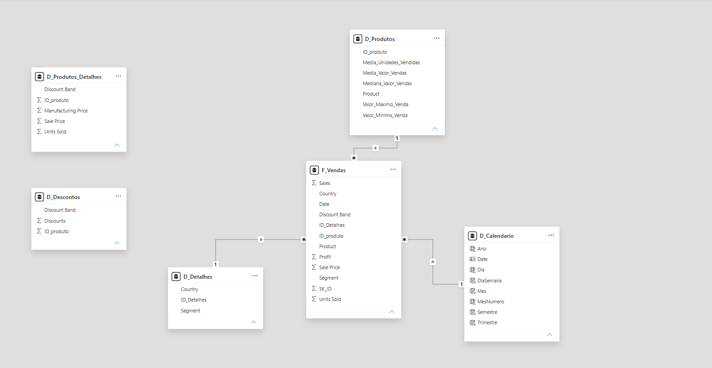

# Desafio de Modelagem Dimensional – Star Schema

Projeto desenvolvido como parte de um desafio da **DIO**, com o objetivo de transformar uma tabela única de dados financeiros em um modelo dimensional baseado em **Star Schema**, utilizando o Power BI.

## Objetivo

A partir da base `Financial Sample`, foi realizada a separação dos dados em tabelas dimensão e tabela fato, buscando melhorar a organização do modelo, facilitar as análises e manter relacionamentos simples e performáticos.

O desafio também propõe a criação de uma tabela calendário utilizando DAX e a documentação de todo o processo no GitHub.

## Estrutura do Modelo

O modelo final possui como tabela fato principal:

* `F_Vendas`

E como dimensões principais:

* `D_Produtos`
* `D_Detalhes`
* `D_Calendario`

Também foram criadas as tabelas auxiliares:

* `D_Produtos_Detalhes`
* `D_Descontos`

A tabela `Financials_origem` foi mantida como fonte de referência e backup dos dados originais, conforme solicitado no desafio.

## Construção das Tabelas

### D_Produtos

A dimensão de produtos foi criada a partir do agrupamento dos registros por produto.

Foram calculadas as seguintes informações:

* Média de unidades vendidas
* Média do valor de vendas
* Mediana do valor de vendas
* Valor máximo de venda
* Valor mínimo de venda

Também foi criado o campo `ID_produto`, utilizado como chave para o relacionamento com a tabela fato.

### D_Produtos_Detalhes

Tabela criada para armazenar informações complementares relacionadas aos produtos:

* `ID_produto`
* `Discount Band`
* `Sale Price`
* `Units Sold`
* `Manufacturing Price`

O `ID_produto` foi obtido por meio de uma mesclagem no Power Query entre os dados originais e a tabela `D_Produtos`.

### D_Descontos

Tabela criada com as informações:

* `ID_produto`
* `Discounts`
* `Discount Band`

O identificador do produto também foi obtido utilizando uma mesclagem com a dimensão `D_Produtos`.

### D_Detalhes

A dimensão `D_Detalhes` foi criada para armazenar informações descritivas das vendas que não estavam contempladas nas demais dimensões.

Foram utilizadas as colunas:

* `Country`
* `Segment`

As combinações duplicadas foram removidas e foi criado o campo `ID_Detalhes`, gerando uma chave única para cada combinação de país e segmento.

## F_Vendas

A tabela fato foi criada a partir dos dados originais e representa cada registro de venda da base.

Ela contém campos como:

* `SK_ID`
* `ID_produto`
* `ID_Detalhes`
* `Product`
* `Units Sold`
* `Sale Price`
* `Discount Band`
* `Segment`
* `Country`
* `Sales`
* `Profit`
* `Date`

Foi criada a chave substituta `SK_ID` utilizando uma coluna de índice no Power Query.

Também foram realizadas mesclagens com `D_Produtos` e `D_Detalhes` para obter as respectivas chaves de dimensão.

Durante a construção da `F_Vendas`, foi realizada uma mesclagem utilizando a combinação de `Country` e `Segment` para obter corretamente o `ID_Detalhes`, preservando as 700 linhas existentes na base original.

## D_Calendario

A dimensão calendário foi criada em DAX utilizando a função `CALENDAR()`:

```DAX
D_Calendario =
CALENDAR(
    MIN(F_Vendas[Date]),
    MAX(F_Vendas[Date])
)
```

Também foram adicionadas as seguintes colunas:

```DAX
Ano = YEAR(D_Calendario[Date])
```

```DAX
MesNumero = MONTH(D_Calendario[Date])
```

```DAX
Mes = FORMAT(D_Calendario[Date], "MMMM")
```

```DAX
Trimestre = "T" & FORMAT(D_Calendario[Date], "Q")
```

```DAX
Semestre =
IF(
    MONTH(D_Calendario[Date]) <= 6,
    "1º Semestre",
    "2º Semestre"
)
```

```DAX
Dia = DAY(D_Calendario[Date])
```

```DAX
DiaSemana = FORMAT(D_Calendario[Date], "dddd")
```

A coluna `Mes` foi ordenada utilizando `MesNumero`, evitando a ordenação alfabética dos meses.

## Relacionamentos

Os relacionamentos principais do modelo foram configurados como **muitos para um (`*:1`)**, com direção de filtro cruzado única.

Relacionamentos utilizados:

* `F_Vendas[ID_produto]` → `D_Produtos[ID_produto]`
* `F_Vendas[ID_Detalhes]` → `D_Detalhes[ID_Detalhes]`
* `F_Vendas[Date]` → `D_Calendario[Date]`

A tabela fato permanece no lado `*` e as dimensões no lado `1`.

As tabelas `D_Produtos_Detalhes` e `D_Descontos` foram mantidas como tabelas auxiliares sem relacionamento direto com `F_Vendas`.

Essa decisão evita relacionamentos muitos-para-muitos, já que `ID_produto` aparece repetidamente tanto nessas tabelas quanto na tabela fato.

## Modelo Final



## Ferramentas e Recursos Utilizados

* Power BI Desktop
* Power Query
* Linguagem M
* DAX
* Mesclagem de consultas
* Agrupamento de dados
* Remoção de duplicatas
* Criação de colunas de índice
* Modelagem dimensional
* Relacionamentos `1:*`

## Arquivos do Projeto

```text
Desafio-Dio-Mod5/
│
├── README.md
├── desafio-star-schema-financial-sample.pbix
├── Financial Sample.xlsx
└── images/
    └── star-schema.png
```

## Fonte de Dados

O projeto utiliza o arquivo `Financial Sample.xlsx` como fonte de dados.

O arquivo `.pbix` contém os dados já importados e pode ser aberto normalmente. Caso seja necessário atualizar a fonte de dados no Power BI, pode ser necessário ajustar manualmente o caminho do arquivo `Financial Sample.xlsx` nas configurações da fonte de dados, de acordo com o diretório em que o projeto foi salvo.

## Conclusão

O projeto permitiu transformar uma tabela única em uma estrutura dimensional mais organizada, separando os dados em tabela fato e dimensões.

Além da criação do Star Schema, foram trabalhados conceitos de granularidade, chaves substitutas, dimensões de calendário, relacionamentos, Power Query e DAX, com atenção para evitar relacionamentos muitos-para-muitos desnecessários e manter o modelo simples e performático.
